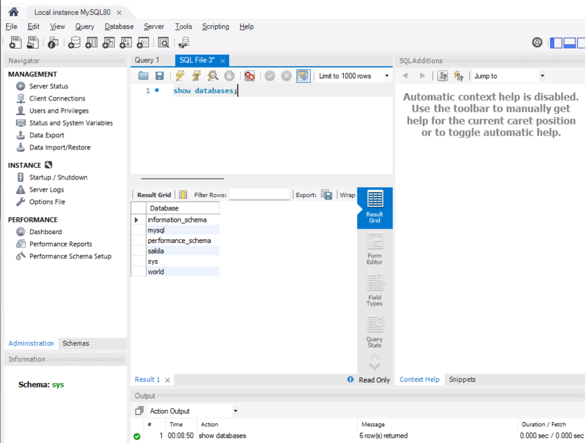
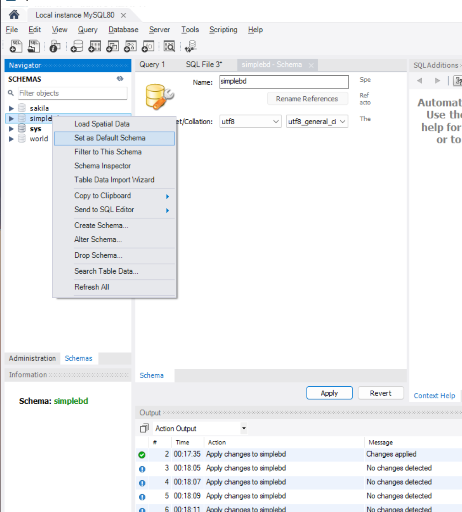
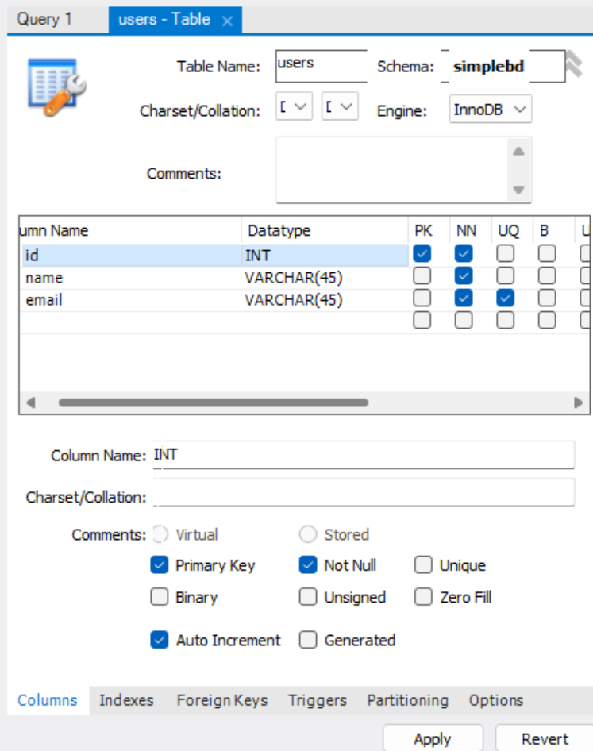
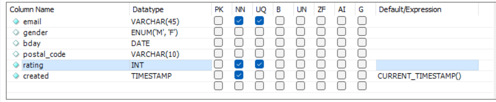
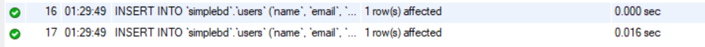
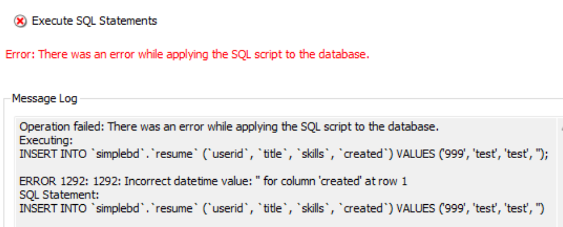
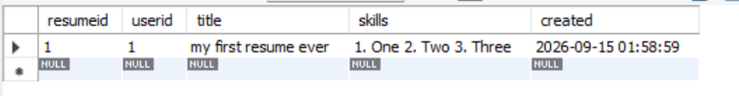
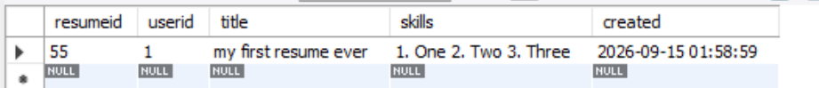

# Лабораторная работа № 1
## Начало работы с MySQL и MySQL Workbench
---
### Задание 1
Разделы в MySQL:

**Раздел “Management”**: 
1. Раздел *“Server Status”*. В разделе отображается общая информация о сервере и подключении к нему. Информация логически сгруппирована. Можно выделить следующие группы: 
     - Общая информация (например, название хоста, номер порта, версия БД).
     - Настройки сервера (например, включен ли брандмауэр, используется ли SSL)
     - Каталоги сервера
     - Сводка по используемым ресурсам компьютера (ОЗУ, процессор и т. д.)
     - Настройки соединения SSL (если SSL включена).
2. Раздел *“Client Connections”*. В разделе отображается статистика и управление текущими подключениями. Можно выделить:
   - Просмотр активных клиентских сессий и хостов.
   - Мониторинг SQL-запросов, выполняемых пользователями в реальном времени.
   - Возможность принудительного отключения зависших соединений.
3. Раздел *“Users and Privileges”*. Инструментарий для управления учетными записями. Включает:
   - Создание, редактирование и удаление пользователей БД.
   - Управление паролями и политиками безопасности учетных записей.
   - Назначение глобальных прав администратора и прав на уровне отдельных схем (баз данных).
4. Раздел *“Status and System Variables”*. Отображает конфигурацию и счетчики работы сервера. Включает:
   - Системные переменные (текущие настройки MySQL сервера).
   - Статусные переменные (аптайм, количество обработанных запросов, статистика сети).
5. Разделы *“Data Export” / “Data Import/Restore”*. Отвечают за резервное копирование и восстановление. Позволяют:
   - Экспортировать структуру таблиц и/или данные в SQL-дампы или CSV-файлы.
   - Восстанавливать базы данных из ранее сохраненных резервных файлов.

**Раздел “Instance” (Экземпляр БД)**:
Этот блок отвечает за контроль над самим процессом СУБД MySQL на уровне операционной системы.
1. Раздел *Startup / Shutdown”*. Управление состоянием службы. Содержит:
   - Индикацию текущего статуса сервера (запущен / остановлен).
   - Инструменты для ручного запуска и остановки процесса базы данных.
2. Раздел *“Server Logs”*. Инструмент для просмотра системных журналов. Включает группы:
   - Error Log (журнал критических и системных ошибок).
   - General Log (общий журнал всех подключений и выполняемых команд).
   - Slow Query Log (журнал медленных запросов, используемый для оптимизации).
3. Раздел *“Options File”*. Визуальный редактор конфигурационного файла сервера (my.ini / my.cnf). Включает:
   - Сетевые настройки (лимиты подключений, тайм-ауты).
   - Настройки выделения оперативной памяти (буферы, кэши для движка InnoDB).
   - Настройки логирования и безопасности.

**Раздел “Performance” (Производительность)**:
Раздел содержит инструменты для аналитики, профилирования и мониторинга нагрузки на базу данных.
1. Раздел *“Dashboard”*. Панель мониторинга в реальном времени. Содержит наглядные круговые/столбчатые диаграммы:
   - Сетевой трафик (входящие и исходящие данные).
   - Статистика типов выполняемых запросов (число SELECT, INSERT, UPDATE).
   - Показатели эффективности использования кэша (InnoDB Buffer Pool).
2. Раздел *“Performance Reports”*. Предоставляет детальные аналитические отчеты. Можно выделить:
   - Отчеты по самым медленным и ресурсоемким запросам.
   - Статистика использования индексов (или выявление таблиц без индексов).
   - -Анализ нагрузки на дисковую систему (I/O). и много других
3. Раздел *“Performance Schema Setup”*. Управление внутренним сборщиком метрик производительности. Включает:
   - Включение/отключение сбора статистики для конкретных компонентов БД.
   - Настройку объема оперативной памяти, выделяемой под хранение метрик производительности.


*Рис. 1. Пробная команда после постановки sys бд по умолчанию:*


### Задание 2
*Рис. 2. Создание бд simplebd и установка по умолчанию*


*Рис. 3. Создание таблицы users*



### Задание 3
Сообщение после создания таблицы:
```sql
CREATE TABLE `users` (
  `id` int NOT NULL AUTO_INCREMENT,
  `name` varchar(45) NOT NULL,
  `email` varchar(45) NOT NULL,
  PRIMARY KEY (`id`),
  UNIQUE KEY `email_UNIQUE` (`email`)
) ENGINE=InnoDB DEFAULT CHARSET=utf8mb3;
```

### Задание 4
Заполним данными таблицу:
```sql
UPDATE `simplebd`.`users` SET `name` = 'Sofi', `email` = 'szh@list.com' WHERE (`id` = '1');
UPDATE `simplebd`.`users` SET `name` = 'Stephan', `email` = 'sp@list.com' WHERE (`id` = '2');
UPDATE `simplebd`.`users` SET `name` = 'Sasha', `email` = 'sr@list.con' WHERE (`id` = '3');
```
Изменим name и email во второй строке:
```sql
UPDATE `simplebd`.`users` SET `name` = 'Pavel', `email` = 'pv@list.com' WHERE (`id` = '2');
```
При этом выполнился запрос:
```sql
SELECT * FROM simplebd.users LIMIT 0, 1000
```

### Задание 5

2) CURRENT_TIMESTAMP() в качестве значения по умолчанию (Default) означает, что при добавлении новой строки СУБД автоматически сгенерирует и запишет в это поле текущую дату и время. Это избавляет от необходимости передавать дату создания записи вручную в SQL-запросе.
3) Пользователю будет удобней, если NULL смогут быть параметры bday, gender. Остальные могут понадобится в любом случае и/или заполнятся автоматически. Eщё рейтинг пользователя не может повторятся с другим, так что поставим его как уникальный.

*Рис. 4. Модифицированная таблица БД*


Запрос после модификации:
```sql
ALTER TABLE `simplebd`.`users` 
ADD COLUMN `gender` ENUM('M', 'F') NULL AFTER `email`,
ADD COLUMN `bday` DATE NULL AFTER `gender`,
ADD COLUMN `postal_code` VARCHAR(10) NOT NULL AFTER `bday`,
ADD COLUMN `rating` INT NOT NULL AFTER `postal_code`,
ADD COLUMN `created` TIMESTAMP NOT NULL DEFAULT CURRENT_TIMESTAMP() AFTER `rating`,
CHANGE COLUMN `name` `name` VARCHAR(50) NOT NULL ;
```

### Задание 6
Данные, заполненные вручную:
```sql
UPDATE `simplebd`.`users` SET `gender` = 'm', `bday` = '2003-10-10' WHERE (`id` = '2');
UPDATE `simplebd`.`users` SET `gender` = 'f', `bday` = '2000-01-02' WHERE (`id` = '1');
UPDATE `simplebd`.`users` SET `gender` = 'f', `bday` = '2001-04-06' WHERE (`id` = '3');
```
*Рис. 5. Данные, добавленные командами*


### Задание 7
Данные экспортированного файла:
```sql
/*
-- Query: SELECT * FROM simplebd.users
LIMIT 0, 1000

-- Date: 2026-09-15 01:43
*/
INSERT INTO `` (`id`,`name`,`email`,`gender`,`bday`,`postal_code`,`rating`,`created`) VALUES (1,'Sofi','szh@list.com','F','2000-01-02','',0,'2026-09-15 01:19:26');
INSERT INTO `` (`id`,`name`,`email`,`gender`,`bday`,`postal_code`,`rating`,`created`) VALUES (2,'Pavel','pv@list.com','M','2003-10-10','',0,'2026-09-15 01:19:26');
INSERT INTO `` (`id`,`name`,`email`,`gender`,`bday`,`postal_code`,`rating`,`created`) VALUES (3,'Sasha','sr@list.con','F','2001-04-06','',0,'2026-09-15 01:19:26');
INSERT INTO `` (`id`,`name`,`email`,`gender`,`bday`,`postal_code`,`rating`,`created`) VALUES (4,'Ekaterina','ekaterina.petrova@outlook.com','F','2000-02-11','145789',1,'2026-09-15 01:29:49');
INSERT INTO `` (`id`,`name`,`email`,`gender`,`bday`,`postal_code`,`rating`,`created`) VALUES (5,'Paul','paul@superpochta.ru','M','1998-08-12','123789',1,'2026-09-15 01:29:49');

```
Анализ:
В этом файле - готовая инструкция для загрузки этой базы данных со всеми внесёнными ранее значениями(INSERT ...). Плюс, в файле есть точная дата и время экспорта этой бд и команда для её просмотра в принципе(SELECT ...). 

### Задание 8
```sql
ALTER TABLE `simplebd`.`resume` 
CHANGE COLUMN `created` `created` TIMESTAMP NOT NULL DEFAULT CURRENT_TIMESTAMP ;
ALTER TABLE `simplebd`.`resume` 
ADD CONSTRAINT `userid`
  FOREIGN KEY (`resumeid`)
  REFERENCES `simplebd`.`users` (`id`)
  ON DELETE CASCADE
  ON UPDATE CASCADE;

```
Анализ: 
Если из таблицы users будет удален пользователь, то СУБД автоматически найдет и удалит все связанные с ним резюме в таблице resume. Аналогично, при изменении id пользователя в таблице users, поле userid во всех его резюме автоматически обновится на новое значение.

### Задание 9
1) Можно добавлять сколько угодно резюме в пределах границ int для resumeid. Но минимальное кол-во - ноль
2) Запросы показывают, какими командами можно заполнить такую же бд, что там записано на момент экспорта и из какой бд и таблицы взяты данные.
```sql
/*
-- Query: SELECT * FROM simplebd.resume
LIMIT 0, 1000

-- Date: 2026-09-15 01:59
*/
INSERT INTO `` (`resumeid`,`userid`,`title`,`skills`,`created`) VALUES (1,1,'my first resume ever','1. One 2. Two 3. Three','2026-09-15 01:58:59');
INSERT INTO `` (`resumeid`,`userid`,`title`,`skills`,`created`) VALUES (2,3,'hello','1. no skills :(','2026-09-15 01:58:59');

   ```
*Рис. 6. Попытка сохранить строку с несуществующим userid*

Добавить строчку с несуществующим userid невозможно. База данных выдает ошибку, т.к. сразу распознаёт отсутствие значения в связанном столбце из дргуой таблицы.

### Задание 10


1)  При удалении пользователя из таблицы users СУБД автоматически удалила все связанные с ним записи из таблицы resume. Если мы проверим таблицу resume, резюме удаленного пользователя там больше не будет.
* пришлось удалять все кроме первой, т.к. id автоматически менялся на тот, который удалялся
```sql
DELETE FROM `simplebd`.`users` WHERE (`id` = '3');
DELETE FROM `simplebd`.`users` WHERE (`id` = '2');
DELETE FROM `simplebd`.`users` WHERE (`id` = '4');
DELETE FROM `simplebd`.`users` WHERE (`id` = '5');

```
*Рис. 7. Удаление строки в resume после удаления строки в users*


2) При изменении ключа (id) пользователя в таблице users СУБД автоматически нашла все подчиненные записи в таблице resume и обновила их поле userid на новое значение. Их связь при этом не нарушилась.
```sql
UPDATE `simplebd`.`users` SET `id` = '55' WHERE (`id` = '2');
```
*Рис. 8. Изменение userid в resume после изменения связанной id в users*


---

#### Выполнила: Жукова СР 2обПОО


