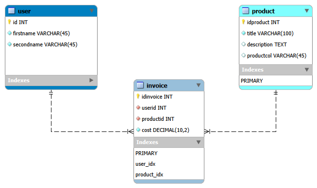
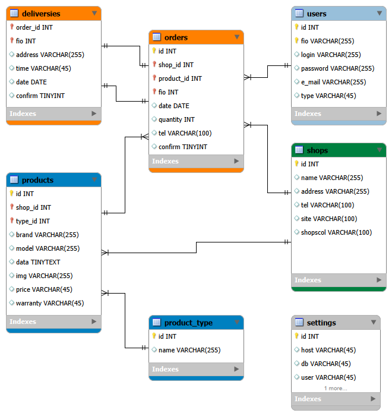
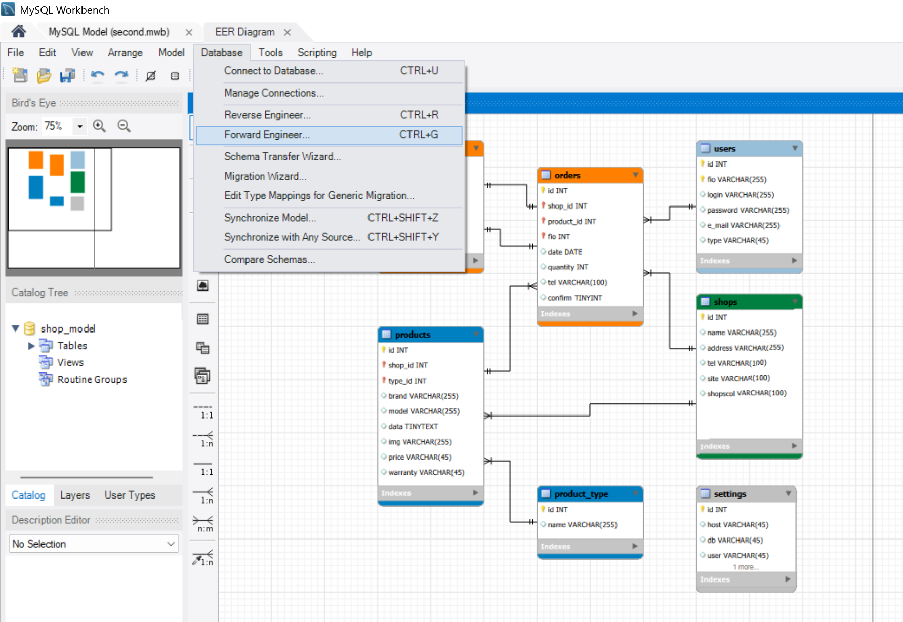
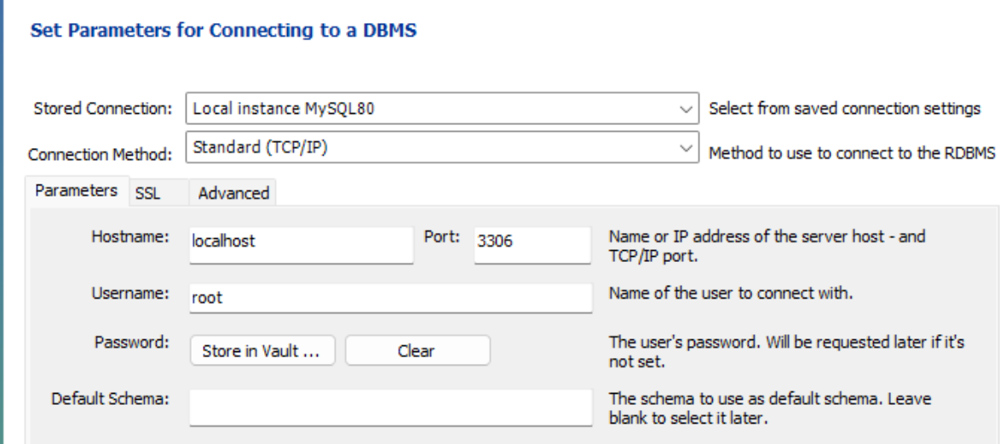
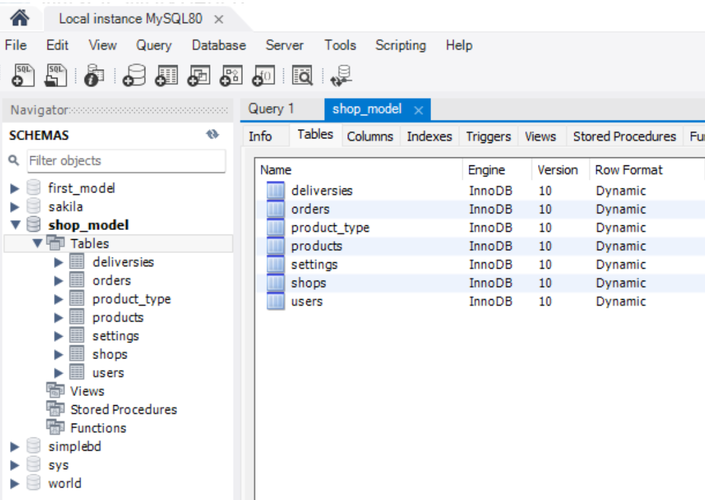

# Лабораторная работа № 2 
## Схема данных. EER-диаграмма

### Цель: 
Продолжить знакомство с MySQL Workbench, языком запросов SQL и начать осваивать 
инструмент проектирования баз данных в визуальном редакторе, который предоставляет это ПО.

### Задание 1
Созданная БД first_model и схема к ней:



Cсылка на скрипт: https://clck.ru/3VvQ9V 

Конкретно часть с созданием и настройкой таблицы invoice:
```sql
CREATE TABLE IF NOT EXISTS `first_model`.`invoice` (
  `idinvoice` INT NOT NULL AUTO_INCREMENT,
  `userid` INT NOT NULL,
  `productid` INT NOT NULL,
  `cost` DECIMAL(10,2) NOT NULL,
  PRIMARY KEY (`idinvoice`),
  INDEX `user_idx` (`userid` ASC) VISIBLE,
  INDEX `product_idx` (`productid` ASC) VISIBLE,
  CONSTRAINT `user`
    FOREIGN KEY (`userid`)
    REFERENCES `first_model`.`user` (`id`)
    ON DELETE CASCADE
    ON UPDATE CASCADE,
  CONSTRAINT `product`
    FOREIGN KEY (`productid`)
    REFERENCES `first_model`.`product` (`idproduct`)
    ON DELETE CASCADE
    ON UPDATE CASCADE)
ENGINE = InnoDB;

```
### Задание 2
Созданная БД shop_model и схема к ней:



Ссылка на полный скрипт: https://clck.ru/3VvUPQ 

Конкретно часть с созданием и настройкой таблицы orders:
```sql
CREATE TABLE IF NOT EXISTS `shop_model`.`orders` (
  `id` INT NOT NULL AUTO_INCREMENT,
  `shop_id` INT NOT NULL,
  `product_id` INT NOT NULL,
  `fio` INT NOT NULL,
  `date` DATE NULL,
  `quantity` INT NULL,
  `tel` VARCHAR(100) NULL,
  `confirm` TINYINT NULL,
  PRIMARY KEY (`id`, `shop_id`, `product_id`, `fio`),
  UNIQUE INDEX `id_UNIQUE` (`id` ASC) VISIBLE,
  INDEX `shops_to_orders_idx` (`shop_id` ASC) VISIBLE,
  INDEX `products_to_orders_idx` (`product_id` ASC) VISIBLE,
  INDEX `users_to_orders_idx` (`fio` ASC) VISIBLE,
  CONSTRAINT `shops_to_orders`
    FOREIGN KEY (`shop_id`)
    REFERENCES `shop_model`.`shops` (`id`)
    ON DELETE CASCADE
    ON UPDATE CASCADE,
  CONSTRAINT `products_to_orders`
    FOREIGN KEY (`product_id`)
    REFERENCES `shop_model`.`products` (`id`)
    ON DELETE CASCADE
    ON UPDATE CASCADE,
  CONSTRAINT `users_to_orders`
    FOREIGN KEY (`fio`)
    REFERENCES `shop_model`.`users` (`id`)
    ON DELETE CASCADE
    ON UPDATE CASCADE)
ENGINE = InnoDB;
```
### Задание 3





### Задание 4


### Выполнила: Жукова СР 2обПОО
